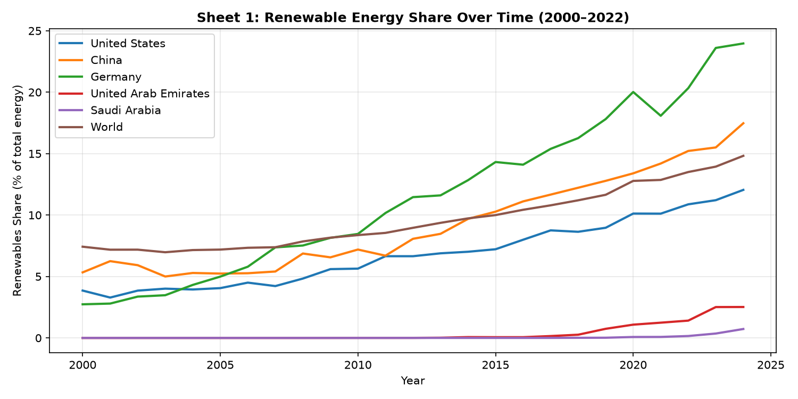
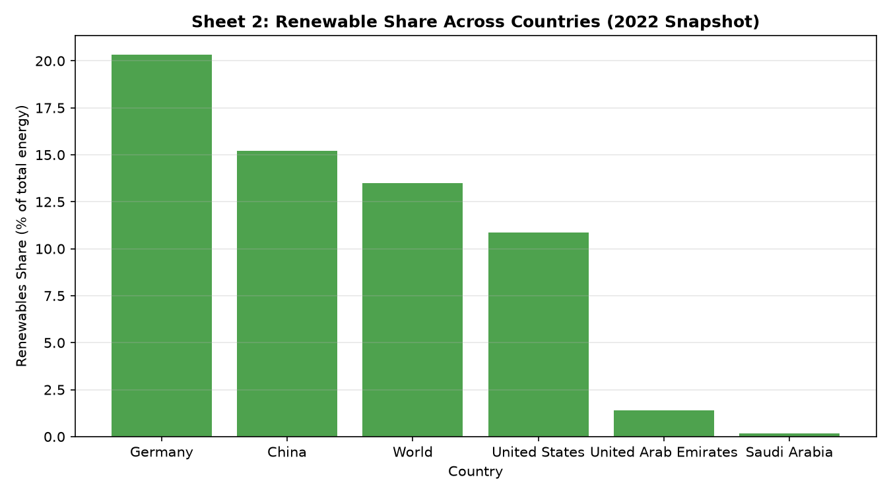
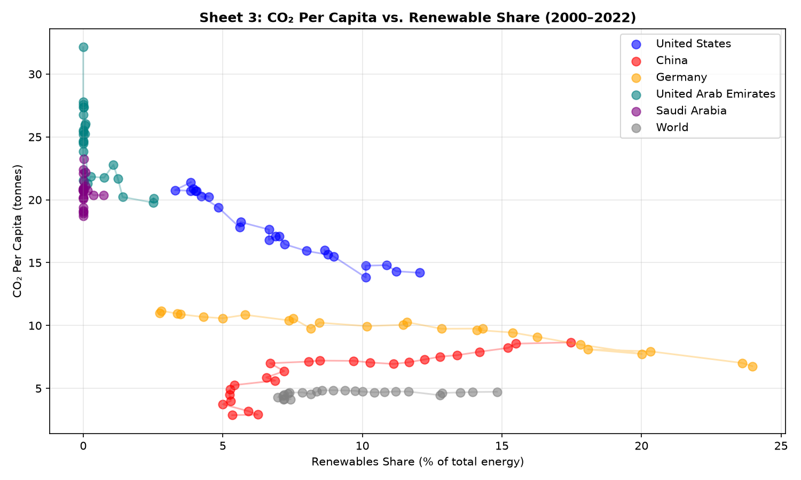

# Global Energy Transition Analysis

Exploratory data analysis of global energy transition trends using the Our World in Data energy dataset. Examines how countries are shifting from fossil fuels to renewable energy sources, with a focus on key metrics relevant to the chemical and process engineering sector.

## Motivation

The energy transition is one of the defining challenges in chemical and process engineering. Understanding how different countries are progressing — and where the gaps remain — is directly relevant to roles in energy, sustainability, and process optimisation.

## Dataset

**Source:** Our World in Data — Energy  
**Link:** https://ourworldindata.org/energy  
**Coverage:** 200+ countries, 2000–2024 (Filtered for analysis timeline)  
**Key variables used:**
- Renewable and fossil fuel share of total energy
- Solar and wind share of total energy
- Energy consumption per capita
- CO₂ emissions per capita

## Countries Analysed

United States · China · Germany · United Arab Emirates · Saudi Arabia · World (Baseline)

Selected to represent a range of energy profiles: high renewables adoption (Germany), major fossil fuel producers (UAE, Saudi Arabia), and the two largest total energy consumers (US, China).

## Key Findings

- **Germany** leads the selected group in renewable energy share, climbing significantly to nearly 25% by 2024.
- **UAE** renewable share historically lagged but shows an upward inflection point in recent years, matching its significant solar infrastructure push.
- **CO₂ per capita** shows a steady, long-term structural decline in the US and Germany.
- **Gulf States (UAE & Saudi Arabia)** maintain elevated per-capita CO₂ footprints, but the UAE’s recent renewable scaling demonstrates an active decoupling strategy.
- **China** shows rapid renewable growth in percentage share over time, though keeping pace with its massive total baseline energy demand remains a challenge.

## Interactive Tableau Dashboard

The complete multi-view interactive analysis can be explored live on the web:

📊 **[View Dashboard on Tableau Public](https://public.tableau.com/app/profile/monther.al.khateeb/viz/GlobalEnergyTransitionAnalysis/Dashboard1)**

The live dashboard includes:
1. **Renewable Energy Share Trends (2000–2024):** Macro timeline comparisons.
2. **Renewable Energy Share Comparison (2022):** Cross-sectional snapshot bar chart.
3. **CO₂ Emissions vs. Renewable Growth Trajectory:** A synchronized dual-axis scatter trail tracking structural shifts over time.

## Visualisations

### 1. Renewable Energy Share Over Time (2000–2024)

### 2. UAE & Regional Energy Profiles (2022 Snapshot)

### 3. CO₂ Per Capita vs. Renewable Energy Trajectories

## How to Run

**1. Install Dependencies**
**2. Run the analysis**

Outputs: `energy_clean.csv` (for Tableau), plus three PNG charts.

## Tools

| Tool | Purpose |
|---|---|
| Python 3.11+ | Core language |
| pandas | Data cleaning and manipulation |
| matplotlib | Static chart generation |
| Tableau Public | Interactive dashboard |

## Author

Monther Al Khateeb — Chemical and Biological Engineering, American University of Sharjah  
[LinkedIn](https://linkedin.com/in/monther-al-khateeb-6a1363319)

